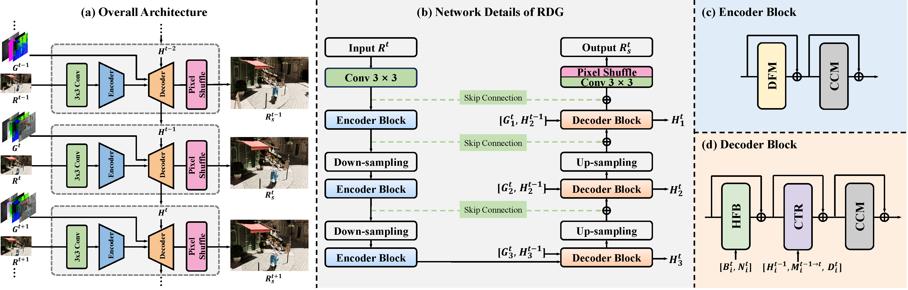
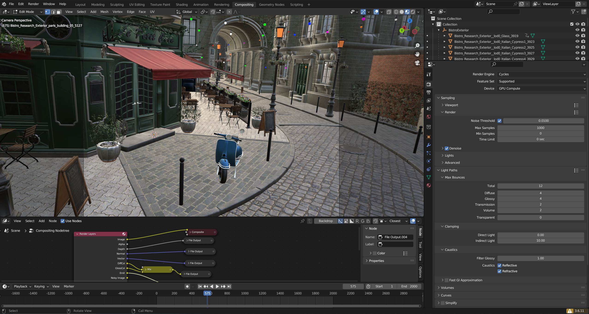
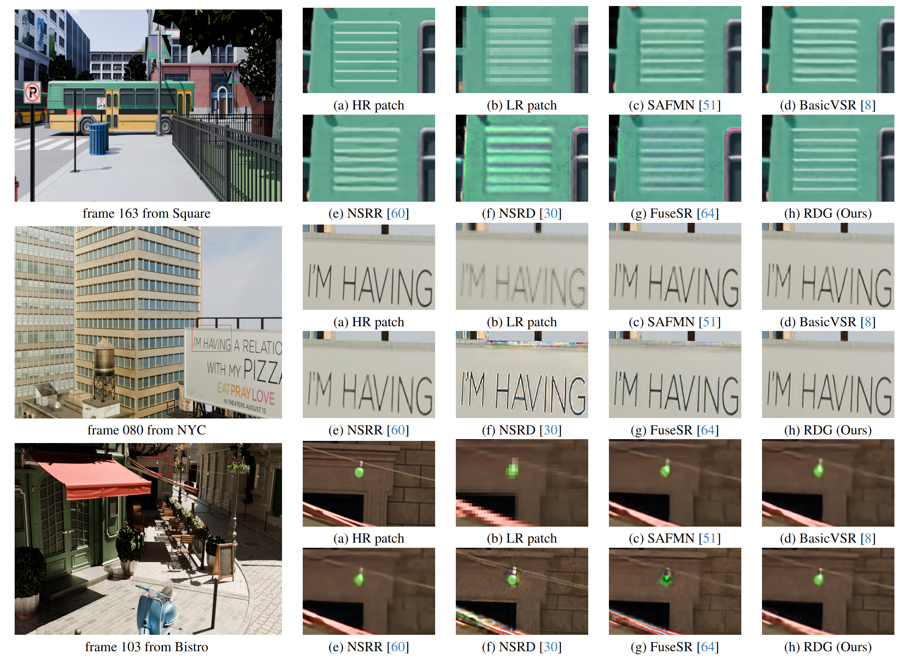
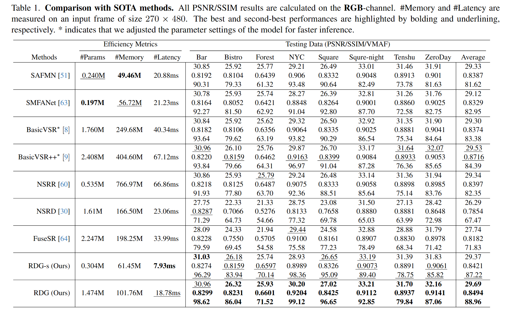

## 📖 Efficient Video Super-Resolution for Real-time Rendering with Decoupled G-buffer Guidance
> [](https://huggingface.co/spaces/Meloo/SAFMN)
[](https://huggingface.co/Meloo/SAFMN/tree/main)

[](https://github.com/sunny2109/RDG) <br>
> [[Paper]()] &emsp;
[[Supp]()]  <br>

> [Mingjun Zheng*](https://github.com/Zheng-MJ),
[Long Sun*](https://github.com/sunny2109),
[Jiangxin Dong](https://scholar.google.com/citations?user=ruebFVEAAAAJ&hl=zh-CN&oi=ao),
and [Jinshan Pan<sup>†</sup>](https://jspan.github.io/) <br>
> [IMAG Lab](https://imag-njust.net/), Nanjing University of Science and Technology


## 📜 News
 - **[2025/03/18]** Code is available now!
 - **[2025/03/13]** The collected dataset is available at [Baidu Cloud](https://pan.baidu.com/s/1v7-0KaXdTPDMaO_wfBQkhg?pwd=RRDG).
 - **[2025/02/28]** RDG is accepted to CVPR 2025!
 - **[2025/02/18]** The project page is released!

## 🚀 Method Overview
<div align="center">
    
</div>

RDG is an efficient asymmetric UNet-based super-resolution network for solving the real-time rendering problem.
We first propose a **dynamic feature modulator** for capturing a precise structura information,
and then incorporate **auxiliary G-buffer information** to guide the decoder to generate detail-rich, temporally stable results.


## 📚 Dataset Generation
<div align="center">
    
</div>
We use the Cycles engine to render the scene model and generate the dataset. The figure above illustrates the detailed rendering settings,
where we set the maximum number of light samples to 1000, the maximum number of light reflections to 12,
HR videos have a spatial resolution of 1920×1080 and 480×270 for their LR counterparts, and the frame rate of the camera is set to 24 FPS.
The collected dataset covers different scenarios such as complex textures and geometries, glossy reflections, and fast-moving objects.


## 👀 Demos
<div align="center">
    
</div>


## 🚀 Quick Started
### 1. Environment Set Up
> - Python 3.8, PyTorch >= 1.11
> - BasicSR 1.4.2
> - Platforms: Ubuntu 18.04, cuda-11

```bash
git clone https://github.com/sunny2109/RDG.git
cd RDG
conda create -n rdg python=3.8
conda activate rdg
# Install dependent packages
pip install -r requirements.txt
# Install BasicSR
python setup.py develop
```

### 2. Download datasets
Please download the collected dataset from [Baidu Cloud](https://pan.baidu.com/s/1v7-0KaXdTPDMaO_wfBQkhg?pwd=RRDG) and put it in `./datasets/`.


### 3. Run the training code
```
# train RDG for x4 effieicnt SR
python basicsr/train.py -opt options/train/train_RDG_x4.yml
```

### 4. Quick inference
- Download the pretrained models.
Please download the pretrained [checkpoints](https://github.com/sunny2109/RDG/tree/main/checkpoints)and put it in `./checkpoints/`.
- Download the testing dataset.
Please download the test dataset from [Baidu Cloud](https://pan.baidu.com/s/1v7-0KaXdTPDMaO_wfBQkhg?pwd=RRDG) and put it in `./datasets/`.
- Run the following commands:
```
python basicsr/test.py -opt options/test/test_RDG_x4.yml
```
- The test results will be in './results'.


## ✨ Experimental Results
<div align="center">
    
</div>


## 📧 Contact
If you have any questions, please feel free to reach us out at cs.longsun@gmail.com or mingjunzheng@njust.edu.cn

## 📎 Citation

If you find our work helpful for your research, please consider giving a star ⭐ and citation 📝
```bibtex
@article{RDG,
  title={Efficient Video Super-Resolution for Real-time Rendering with Decoupled G-buffer Guidance},
  author={Zheng, Mingjun and Sun, Long and Dong, Jiangxin and Pan, Jinshan},
  booktitle={CVPR},
  year={2025}
}
